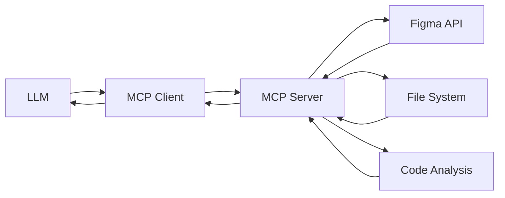

# Custom Figma MCP Tools - Technical Documentation

This document provides detailed technical explanations of how each tool works, how LLMs understand and interact with them, and the underlying implementation details.

## Table of Contents

1. [How MCP Tools Work](#how-mcp-tools-work)
2. [Core Figma API Tools](#core-figma-api-tools)
3. [Design System Analysis Tools](#design-system-analysis-tools)
4. [Component Reusability Tools](#component-reusability-tools)
5. [LLM Integration Patterns](#llm-integration-patterns)
6. [Technical Implementation Details](#technical-implementation-details)

---

## How MCP Tools Work

### MCP Protocol Overview

The Model Context Protocol (MCP) enables LLMs to interact with external tools through a standardized interface. Here's how it works:



### Tool Discovery Process

1. **Tool Registration**: Each tool is registered with a schema defining its name, description, and input parameters
2. **LLM Discovery**: The LLM calls `tools/list` to discover available tools
3. **Tool Execution**: The LLM calls `tools/call` with the tool name and parameters
4. **Response Processing**: The tool returns structured data that the LLM can understand and use

### How LLMs Understand Tools

LLMs understand tools through:
- **Descriptive names**: Clear, action-oriented names like `get_figma_file`
- **Rich descriptions**: Detailed explanations of what each tool does
- **JSON Schema**: Structured parameter definitions with types and descriptions
- **Examples**: Usage examples in the schema help guide proper usage

---

## Core Figma API Tools

### 1. `get_figma_file`

**Purpose**: Retrieve complete file structure and metadata from Figma

**How it works**:
```typescript
// API Call: GET /v1/files/{file_key}
const response = await fetch(`https://api.figma.com/v1/files/${file_key}`, {
  headers: { 'X-Figma-Token': token }
});
```

**What the LLM receives**:
```json
{
  "name": "Design System",
  "version": "1.2.3",
  "document": {
    "children": [
      {
        "type": "CANVAS",
        "name": "Homepage",
        "children": [
          {
            "type": "FRAME",
            "name": "Header",
            "children": [...] // All nested elements
          }
        ]
      }
    ]
  }
}
```

**LLM Understanding**:
- The LLM sees the complete hierarchical structure
- Can identify pages, frames, components, and their relationships
- Understands design organization and naming conventions
- Can traverse the tree to find specific elements

**Use Cases**:
- Understanding overall design structure
- Finding specific components or frames
- Analyzing design organization patterns
- Getting metadata like version and last modified date

### 2. `get_figma_components`

**Purpose**: Retrieve all reusable components from a Figma file

**How it works**:
```typescript
// API Call: GET /v1/files/{file_key}/components
// Returns component definitions with metadata
```

**What the LLM receives**:
```json
{
  "meta": {
    "components": {
      "component_id_1": {
        "name": "Button/Primary",
        "description": "Primary action button with hover states",
        "componentSetId": "set_id_1",
        "documentationLinks": []
      }
    }
  }
}
```

**LLM Understanding**:
- Identifies all reusable design components
- Understands component hierarchies (Button/Primary, Button/Secondary)
- Can map component names to potential code implementations
- Recognizes component variants and states

### 3. `export_figma_image`

**Purpose**: Export visual assets from specific Figma nodes

**How it works**:
```typescript
// API Call: GET /v1/images/{file_key}?ids=node1,node2&format=png&scale=2
// Returns URLs to rendered images
```

**Parameters Explained**:
- `node_ids`: Array of specific element IDs to export
- `format`: Output format (PNG, JPG, SVG, PDF)
- `scale`: Resolution multiplier (1-4x)

**LLM Understanding**:
- Can request specific visual elements
- Understands different export formats for different use cases
- Can scale images for different screen densities
- Receives URLs to download the actual image files

### 4. `get_figma_team_projects`

**Purpose**: Access organizational structure and project management

**How it works**:
```typescript
// API Call: GET /v1/teams/{team_id}/projects
// Returns project listings and permissions
```

**LLM Understanding**:
- Sees project organization within teams
- Can identify related design files
- Understands project permissions and access levels
- Can navigate organizational hierarchies

### 5. `search_figma_files`

**Purpose**: Search for files within a team using queries

**How it works**:
```typescript
// API Call: GET /v1/teams/{team_id}/projects?query={search_term}
// Returns filtered project results
```

**LLM Understanding**:
- Can find files by name or content
- Understands search relevance and ranking
- Can discover related design files
- Helps with file discovery in large organizations

---

## Design System Analysis Tools

### 6. `get_figma_styles`

**Purpose**: Extract design system styles (colors, typography, effects)

**How it works**:
```typescript
// API Call: GET /v1/files/{file_key}/styles
// Returns all published styles
```

**What the LLM receives**:
```json
{
  "meta": {
    "styles": {
      "style_id_1": {
        "name": "Colors/Primary/Blue",
        "styleType": "FILL",
        "description": "Primary brand color"
      },
      "style_id_2": {
        "name": "Typography/Heading/H1",
        "styleType": "TEXT",
        "description": "Main page heading style"
      }
    }
  }
}
```

**LLM Understanding**:
- Identifies design tokens and style systems
- Understands color palettes and naming conventions
- Recognizes typography hierarchies
- Can map styles to CSS/code implementations

### 7. `analyze_figma_design_system`

**Purpose**: Comprehensive analysis combining components, styles, and structure

**How it works**:
```typescript
// Makes multiple API calls:
// 1. GET /files/{file_key} - File structure
// 2. GET /files/{file_key}/components - Components
// 3. GET /files/{file_key}/styles - Styles
// Combines and analyzes the data
```

**Analysis Process**:
1. **Structure Analysis**: Pages, frames, organization patterns
2. **Component Analysis**: Count, naming patterns, variants
3. **Style Analysis**: Design tokens, consistency patterns
4. **Pattern Recognition**: Common design patterns and conventions

**What the LLM receives**:
```json
{
  "design_system": {
    "file_info": {
      "name": "Design System v2",
      "pages": 5,
      "version": "1.2.3"
    },
    "components": {
      "count": 47,
      "categories": ["Buttons", "Forms", "Navigation", "Cards"]
    },
    "styles": {
      "colors": 24,
      "typography": 12,
      "effects": 8
    },
    "structure": {
      "pages": [
        {"name": "Components", "frames": 15},
        {"name": "Tokens", "frames": 8}
      ]
    }
  }
}
```

**LLM Understanding**:
- Gets holistic view of design system maturity
- Understands design organization and governance
- Can identify gaps or inconsistencies
- Provides foundation for implementation planning

### 8. `get_figma_version_history`

**Purpose**: Access file evolution and collaboration history

**How it works**:
```typescript
// API Calls:
// 1. GET /v1/files/{file_key}/versions - Version history
// 2. GET /v1/files/{file_key}/comments - Comments and feedback
```

**LLM Understanding**:
- Sees design evolution over time
- Understands collaboration patterns
- Can identify recent changes and their context
- Helps with change management and communication

---

## Component Reusability Tools

### 9. `map_figma_to_code_components`

**Purpose**: Intelligent mapping between Figma designs and existing code

**How it works**:

#### Step 1: Figma Component Discovery
```typescript
// Get all Figma components
const figmaComponents = await this.makeRequest(`/files/${file_key}/components`);
```

#### Step 2: Code Component Scanning
```typescript
// Recursively scan code directory
const files = this.getAllFiles(directory, ['.tsx', '.jsx', '.vue', '.ts']);
files.forEach(file => {
  const content = fs.readFileSync(file, 'utf8');
  const componentInfo = this.extractComponentInfo(file, content, framework);
});
```

#### Step 3: Intelligent Matching
```typescript
// Name similarity algorithm using Longest Common Subsequence
const similarity = this.calculateNameSimilarity(figmaName, codeName);
// Threshold-based matching (exact > 0.9, similar > 0.5)
```

**Matching Algorithm**:
1. **Exact Match**: Case-insensitive name comparison
2. **Similarity Score**: Longest Common Subsequence algorithm
3. **Pattern Recognition**: Common naming patterns (Button vs btn, Card vs card-component)
4. **Confidence Scoring**: Mathematical confidence based on similarity

**What the LLM receives**:
```json
{
  "mappings": {
    "exact_matches": [
      {
        "figma_name": "Button",
        "code_component": {
          "name": "Button",
          "path": "./src/components/Button.tsx",
          "exports": ["Button", "ButtonProps"],
          "props": ["variant", "size", "onClick"]
        },
        "confidence": 1.0
      }
    ],
    "similar_matches": [
      {
        "figma_name": "HeaderNav",
        "suggestions": [
          {
            "component": {
              "name": "Navbar",
              "path": "./src/components/Navbar.tsx"
            },
            "similarity": 0.75
          }
        ]
      }
    ],
    "missing_in_code": [
      {
        "figma_name": "ProductGrid",
        "description": "Grid layout for product listings"
      }
    ]
  }
}
```

**LLM Understanding**:
- **Exact Matches**: Can reuse directly without changes
- **Similar Matches**: Can modify existing components
- **Missing Components**: Need to build from scratch
- **Confidence Scores**: Help prioritize implementation decisions

### 10. `generate_component_usage_guide`

**Purpose**: Create implementation guides for using existing components

**How it works**:

#### Guide Generation Process
1. **Data Collection**: Combines Figma component data with mapping results
2. **Format Selection**: Markdown, JSON, or TypeScript output
3. **Usage Pattern Generation**: Creates practical usage examples
4. **Documentation Generation**: Structured implementation guidance

**Markdown Output Example**:
```markdown
# Component Usage Guide

## Reusable Components

### Button Component
- **Figma**: Button/Primary, Button/Secondary
- **Code**: `./src/components/Button.tsx`
- **Usage**: 
  ```tsx
  import { Button } from './components/Button';
  <Button variant="primary" size="large">Click Me</Button>
  ```

### Missing Components

### ProductGrid
- **Status**: Needs Implementation
- **Suggestion**: Create new component based on existing Card pattern
```

**TypeScript Output Example**:
```typescript
export interface ComponentMapping {
  figmaId: string;
  figmaName: string;
  codeComponent?: string;
  status: 'available' | 'similar' | 'missing';
}

export const componentMappings: ComponentMapping[] = [
  {
    figmaId: "123:456",
    figmaName: "Button",
    codeComponent: "./src/components/Button.tsx",
    status: "available"
  }
];
```

**LLM Understanding**:
- Gets structured implementation roadmap
- Understands which components to reuse vs. build
- Receives concrete usage examples
- Can generate implementation code based on patterns

### 11. `analyze_design_code_consistency`

**Purpose**: Identify misalignments between design and implementation

**How it works**:

#### Analysis Process
1. **Component Comparison**: Match implemented components with designs
2. **Style Analysis**: Compare design tokens with CSS/style implementations
3. **Gap Identification**: Find missing or inconsistent implementations
4. **Scoring Algorithm**: Calculate consistency percentage

**Consistency Checks**:
- **Component Names**: Naming convention alignment
- **Component Structure**: Props and variants consistency
- **Visual Properties**: Colors, typography, spacing alignment
- **Behavioral Properties**: Interactions and states

**What the LLM receives**:
```json
{
  "consistency_score": 78,
  "issues": [
    {
      "type": "component_mismatch",
      "figma_component": "Button/Primary",
      "code_component": "PrimaryButton",
      "issue": "Naming convention mismatch",
      "severity": "medium"
    },
    {
      "type": "style_inconsistency",
      "figma_style": "Colors/Primary/Blue",
      "code_value": "#007bff",
      "figma_value": "#0066cc",
      "issue": "Color value mismatch",
      "severity": "high"
    }
  ],
  "recommendations": [
    "Align component naming conventions",
    "Update color values to match design tokens",
    "Add missing component variants"
  ]
}
```

**LLM Understanding**:
- Identifies specific inconsistencies to fix
- Understands severity levels for prioritization
- Gets actionable recommendations
- Can generate code changes to improve consistency

---

## LLM Integration Patterns

### How LLMs Use These Tools

#### 1. Discovery Pattern
```
LLM: "I need to understand this design system"
→ calls get_figma_file
→ calls analyze_figma_design_system
→ gets comprehensive overview
```

#### 2. Component Reuse Pattern
```
LLM: "User wants to implement this Figma design"
→ calls map_figma_to_code_components
→ identifies reusable components
→ calls generate_component_usage_guide
→ creates implementation plan using existing code
```

#### 3. Implementation Validation Pattern
```
LLM: "Let me check if the implementation matches the design"
→ calls analyze_design_code_consistency
→ identifies gaps and issues
→ suggests specific fixes
```

#### 4. Asset Export Pattern
```
LLM: "I need the visual assets for this component"
→ calls get_figma_file to find node IDs
→ calls export_figma_image with specific nodes
→ gets downloadable image URLs
```

### Tool Chaining Strategies

#### Strategy 1: Comprehensive Analysis
1. `get_figma_file` → Understand structure
2. `get_figma_components` → Identify reusable elements
3. `get_figma_styles` → Extract design tokens
4. `analyze_figma_design_system` → Get holistic view

#### Strategy 2: Implementation Planning
1. `map_figma_to_code_components` → Find reusable code
2. `generate_component_usage_guide` → Create implementation plan
3. `analyze_design_code_consistency` → Validate alignment

#### Strategy 3: Asset Production
1. `get_figma_file` → Find elements to export
2. `export_figma_image` → Generate assets
3. `get_figma_version_history` → Understand changes

---

## Technical Implementation Details

### Authentication Flow
```typescript
private async makeRequest(endpoint: string): Promise<any> {
  if (!this.figmaToken) {
    throw new McpError(ErrorCode.InvalidRequest, 'Figma access token required');
  }
  
  const response = await fetch(`${FIGMA_API_BASE}${endpoint}`, {
    headers: {
      'X-Figma-Token': this.figmaToken,
      'Content-Type': 'application/json',
    },
  });
  
  if (!response.ok) {
    throw new McpError(ErrorCode.InternalError, `API error: ${response.status}`);
  }
  
  return response.json();
}
```

### Error Handling Strategy
- **Authentication Errors**: Clear messages about token setup
- **API Rate Limits**: Graceful handling with retry suggestions
- **File Access Errors**: Specific guidance on permissions
- **Network Errors**: Fallback strategies and user guidance

### Performance Considerations
- **Caching**: Component and style data caching for repeated requests
- **Parallel Requests**: Multiple API calls executed concurrently
- **Selective Loading**: Only fetch required data based on parameters
- **Streaming**: Large file operations handled in chunks

### Code Analysis Implementation
```typescript
private extractComponentInfo(filePath: string, content: string, framework: string) {
  // Framework-specific parsing
  const patterns = {
    react: /(?:export\s+(?:default\s+)?(?:function|const|class)\s+(\w+))/g,
    vue: /<template>|export\s+default\s*\{/g,
    angular: /@Component\s*\(/g
  };
  
  // Extract component metadata
  return {
    name: fileName,
    path: filePath,
    framework,
    exports: this.extractExports(content, framework),
    props: this.extractProps(content, framework)
  };
}
```

### Similarity Algorithm
```typescript
private calculateNameSimilarity(name1: string, name2: string): number {
  // Longest Common Subsequence algorithm
  const lcs = this.longestCommonSubsequence(name1, name2);
  return (2 * lcs) / (name1.length + name2.length);
}
```

### Framework Support Matrix
| Framework | File Extensions | Component Detection | Props Extraction |
|-----------|----------------|-------------------|------------------|
| React | .jsx, .tsx | ✅ Function/Class exports | ✅ TypeScript interfaces |
| Vue | .vue | ✅ Template detection | ✅ Props object |
| Angular | .component.ts | ✅ @Component decorator | ✅ Input decorators |
| Svelte | .svelte | ✅ Script blocks | ✅ Export declarations |
| Vanilla | .js, .ts | ✅ Function/Class detection | ✅ JSDoc parsing |

---

## Best Practices for LLM Integration

### 1. Tool Selection
- Use `get_figma_file` for comprehensive understanding
- Use `map_figma_to_code_components` when existing code is present
- Use `analyze_figma_design_system` for design system work
- Chain tools for complex workflows

### 2. Error Recovery
- Always check for authentication before API calls
- Provide fallback strategies for failed requests
- Give clear guidance on setup and permissions

### 3. Performance Optimization
- Cache frequently accessed data
- Use parallel requests when possible
- Only fetch required data based on use case

### 4. User Experience
- Provide progress indicators for long operations
- Give clear status updates during processing
- Offer actionable recommendations in results

---

This documentation provides the technical foundation for understanding how each tool works and how LLMs can effectively use them to bridge the gap between Figma designs and code implementations. 